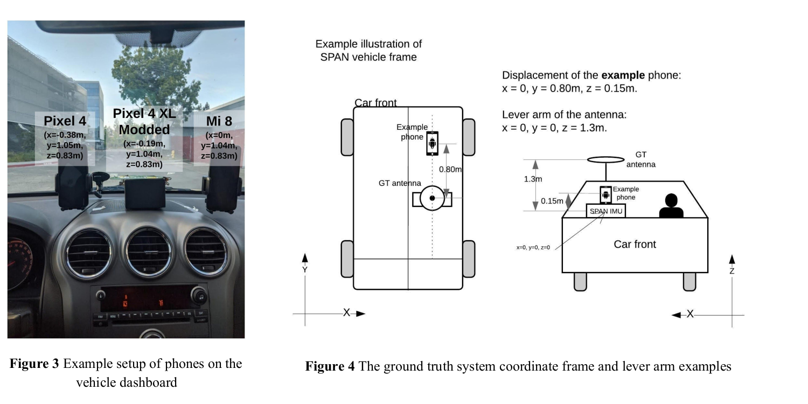
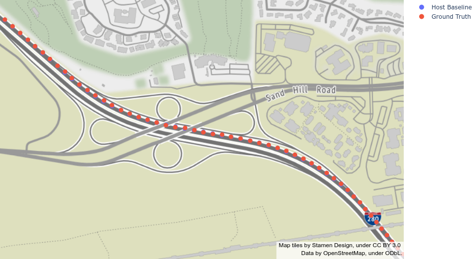
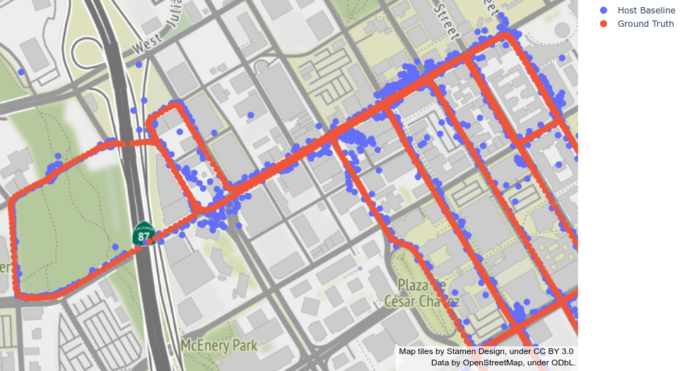
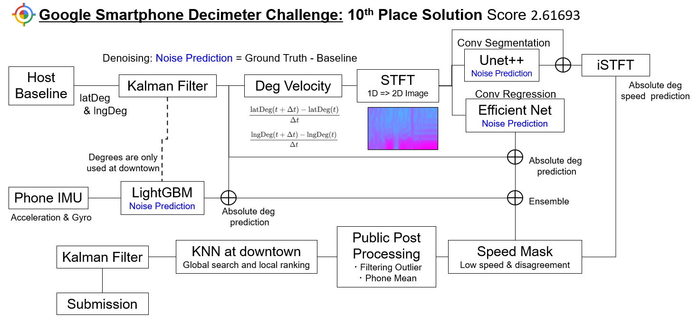
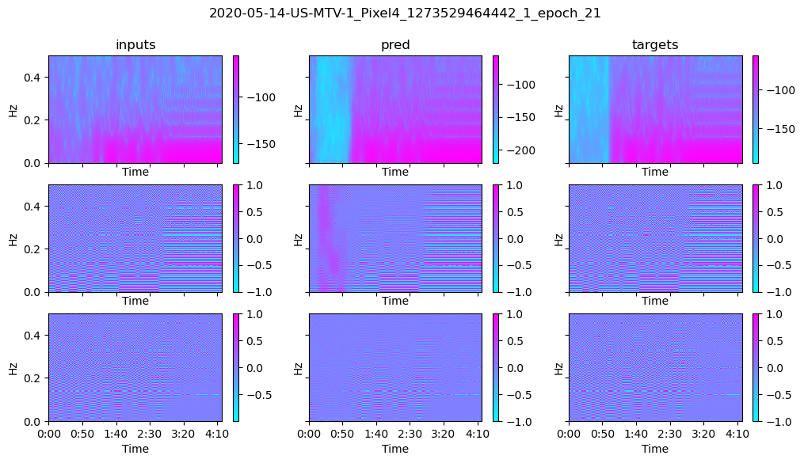
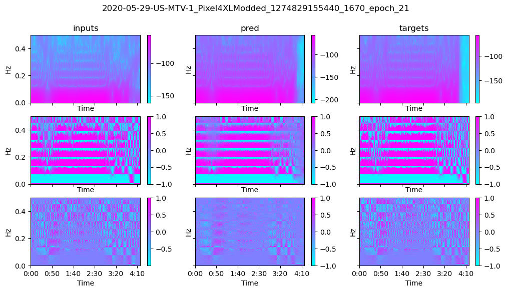

# Google Smartphone Decimeter Challenge at kaggle.
 [Google Smartphone Decimeter Challenge](https://www.kaggle.com/c/google-smartphone-decimeter-challenge/overview)


    Global Navigation Satellite System (GNSS) provides raw signals, which the GPS chipset uses to compute a position.
    Current mobile phones only offer 3-5 meters of positioning accuracy. While useful in many cases,
    it can create a “jumpy” experience. For many use cases the results are not fine nor stable enough to be reliable.

    This competition, hosted by the Android GPS team, is being presented at the ION GNSS+ 2021 Conference.
    They seek to advance research in smartphone GNSS positioning accuracy
    and help people better navigate the world around them.

    In this competition, you'll use data collected from the host team’s own Android phones
    to compute location down to decimeter or even centimeter resolution, if possible.
    You'll have access to precise ground truth, raw GPS measurements,
    and assistance data from nearby GPS stations, in order to train and test your submissions.

* Setup of the data collection, from [this paper](https://www.kaggle.com/google/android-smartphones-high-accuracy-datasets?select=ION+GNSS+2020+Android+Raw+GNSS+Measurement+Datasets+for+Precise+Positioning.pdf)


* Predictions with host baseline for highway area(upper figure) are really good, but for downtown area(lower figure) are noisy due to the effect of [Multipath](https://gssc.esa.int/navipedia/index.php/Multipath).



## Overview
* Predicting the Noise, `Noise = Ground Truth - Baseline`, like denoising in computer vision
* Using the speed `latDeg(t + dt) - latDeg(t)/dt`  as input  instead of the absolute position for preventing overfitting on the train dataset.
* Making 2D image input with Short Time Fourier Transform, STFT, and then using ImageNet convolutional neural network




## STFT and Conv Network Part
* Input: Using [librosa](https://librosa.org/doc/latest/index.html),  generating STFT for both latDeg&lngDeg speeds.
    + Each phone sequence are split into 256 seconds sequence then STFT with `n_tft=256`, `hop_length=1` and `win_length=16` , result in (256, 127, 2) feature for each degree. The following 2D images are generated  from 1D sequence.


* Model: Regression and Segmentation
    * Regression: EfficientNet B3, predict latDeg&lngDeg noise,
    * Segmentation: Unet ++ with EfficientNet encoder([segmentation pyroch](https://github.com/qubvel/segmentation_models.pytorch)) , predict stft  noise
        * segmentation prediction + input STFT ->  inverse STFT -> prediction of latDeg&lngDeg speeds

        * this speed prediction was used for:
            1. Low speed mask;  The points of low speed area are replaced with its median.
            2. Speed disagreement mask: If the speed from position prediction and this speed prediction differ a lot, remove such points and interpolate.
        * prediction example for the segmentation.
         
         


## LightGBM Part
  * Input: IMU data excluding magnetic filed feature
      * also excluding y acceleration and z gyro because of phone mounting condition
      * adding moving average as additional features, `window_size=5, 15, 45`
  * Predict latDeg&lngDeg noise

## KNN at downtown Part
similar to [Snap to Grid](https://www.kaggle.com/robikscube/indoor-navigation-snap-to-grid-post-processing), but using both global and local feature. Local re-ranking comes from the  host baseline of [GLR2021](https://www.kaggle.com/c/landmark-retrieval-2020)
* Use train ground truth as database
* Global search: query(latDeg&lngDeg) -> find 10 candidates
* Local re-ranking: query(latDeg&lngDeg speeds and its moving averages) -> find 3 candidates -> taking mean over candidates


## Public Post Process Part
There are lots of nice and effective PPs in public notebooks. Thanks to the all authors. I used the following notebooks.
* [phone mean](https://www.kaggle.com/t88take/gsdc-phones-mean-prediction)
* [filtering outlier](https://www.kaggle.com/dehokanta/baseline-post-processing-by-outlier-correction)
* [kalman filter](https://www.kaggle.com/emaerthin/demonstration-of-the-kalman-filter)
* [gauss smoothing&phone mean](https://www.kaggle.com/bpetrb/adaptive-gauss-phone-mean)

## How to run
### environment
* Ubuntu 18.04
* Python with Anaconda
* NVIDIA GPUx1

### Data Preparation
First, download the data, [here](https://www.kaggle.com/c/google-smartphone-decimeter-challenge/data),
and then place it like below.
```bash
../input/
    └ google-smartphone-decimeter-challenge/
```
During run, temporary cached will be stored under `../data/` and outputs will be stored under `../working/` through
[hydra](https://hydra.cc/).


### Code&Pacakage Installation
```bash
# clone project
git clone https://github.com/Fkaneko/kaggle_Google_Smartphone_Decimeter_Challenge

# install project
cd kaggle_Google_Smartphone_Decimeter_Challenge
conda create -n gsdc_conv python==3.8.0
yes | bash install.sh
# at my case I need an additional run of `yes | bash install.sh` for installation.
 ```
### Training/Testing

#### 3 different models
* for conv training, `python train.py` at each branch.  Please check the `src/config/config.yaml` for the training configuration.
* for `LightGBM position` you need `mv ./src/notebook/lightgbm_position_prediction.ipynb ./` and then starting juypter notebook.

| model                  | branch        | training                                          | test |
| ---                    | ---           | ---                                               | ---  |
| conv stft segmentation | main        | ./train.py                                        | ./test.py      |
| conv position          | conv_position | ./train.py                                        | ./test.py      |
| LightGBM position      | main        | ./src/notebook/lightgbm_position_prediction.ipynb | included training notebook     |


### Testing

#### 10th place solution trained weights
I've uploaded pretrained weights as kaggle dataset, [here](https://www.kaggle.com/sai11fkaneko/google-smartphone-decimeter-challenge-weights).
So extract it on `./` and you can see `./model_weights`. And then running `python test.py` yields `submission.csv`. This csv will score
~2.61 at kaggle private dataset, which equals to 10th place.

#### your trained weights
For `conv stft segmentation` please change paths at the config, `src/config/test_weights/compe_sub_github.yaml`,
and then run followings.
```bash
# at main branch
python test.py  \
     conv_pred_path="your conv position prediction csv path"\
     gbm_pred_path="your lightgbm position prediction path"
```
Regarding, `conv_pred_path` and `gbm_pred_path`, you need to create each prediction csv with the table above
before run this code. Or you can use mv prediction results on [the same kaggle dataset as pretrained weights](https://www.kaggle.com/sai11fkaneko/google-smartphone-decimeter-challenge-weights).


## License
#### Code
Apache 2.0

#### Dataset
Please check the kaggle page -> https://www.kaggle.com/c/google-smartphone-decimeter-challenge/rules

#### pretrained weights
These trained weights were generated from ImageNet pretrained weights.
So please check ImageNet license if you use pretrained weights for a serious case.
